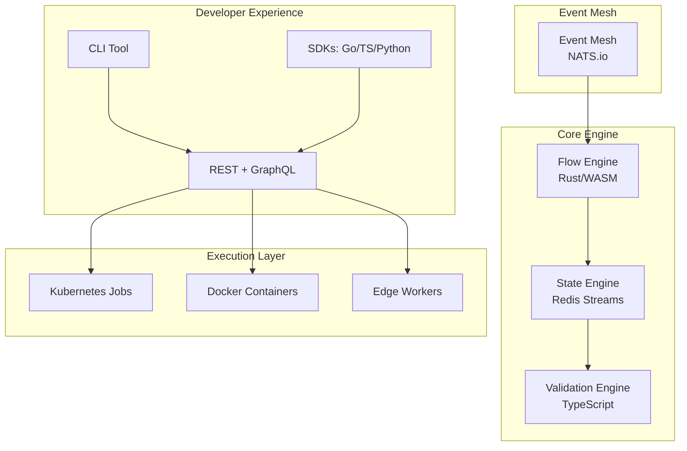

# FlowForge Nexus 🌊⚙️

**Next-Generation Event-Driven Workflow Automation Platform**

> **"Finally, a workflow platform that scales with your complexity instead of fighting it."**

[](https://opensource.org/licenses/MIT)
[](https://goreportcard.com/report/github.com/flowforge-nexus/nexus)
[](https://discord.gg/flowforge-nexus)
[](https://hub.docker.com/r/flowforge/nexus)

## 🚀 Why FlowForge Nexus?

We built Nexus because we were frustrated with existing solutions. Here's what makes us different:

| Problem with n8n/Others | FlowForge Nexus Solution |
|------------------------|-------------------------|
| ❌ GUI becomes spaghetti for complex logic | ✅ **Code-first with visual debugging** - Write real code, see it run |
| ❌ Memory leaks & scaling issues | ✅ **Rust core + WebAssembly** - 10x memory efficiency |
| ❌ Vendor lock-in & hosted limitations | ✅ **100% open source + self-hosted** - No limits, no lock-in |
| ❌ Debugging black boxes | ✅ **Full observability** - Distributed tracing built-in |
| ❌ Poor version control | ✅ **Git-native workflows** - Every change is a commit |
| ❌ Limited testing capabilities | ✅ **Built-in testing framework** - Unit test your workflows |

## 🏗️ Architecture Overview



## ✨ Key Features

### 🎯 **Developer-First Design**
- **Code-first workflows** in TypeScript, Python, Go, or Rust
- **Git-native versioning** - every workflow is code
- **Local development** with hot-reload
- **Unit testing** for workflows with Jest/Pytest

### 🔄 **Event-Driven Architecture**
- **NATS.io event mesh** for distributed messaging
- **Event sourcing** for complete audit trails
- **CQRS pattern** for scalable read/write separation
- **Dead letter queues** with automatic retry policies

### 🐳 **Cloud-Native & Scalable**
- **Kubernetes-native** deployment
- **Horizontal pod autoscaling** based on queue depth
- **Multi-region** replication
- **Zero-downtime** updates with blue-green deployments

### 🔍 **Observability First**
- **OpenTelemetry** tracing across all workflows
- **Structured logging** with correlation IDs
- **Real-time metrics** via Prometheus
- **Distributed tracing** with Jaeger

### 🛡️ **Enterprise Security**
- **RBAC** with fine-grained permissions
- **Secret management** with HashiCorp Vault
- **Audit logging** for compliance
- **mTLS** for service-to-service communication

## 🏁 Quick Start

### 1. Install CLI
```bash
# macOS
brew install flowforge/tap/nexus-cli

# Linux
curl -sSL https://get.nexus.flowforge.io | sh

# Windows
winget install flowforge.nexus
```

### 2. Create Your First Workflow
```typescript
// workflows/hello-world.ts
import { Workflow, Event, Step } from '@flowforge/sdk';

export default new Workflow('hello-world')
  .trigger('user.created')
  .step('send-welcome-email', async (event: Event) => {
    await email.send({
      to: event.data.email,
      subject: 'Welcome!',
      template: 'welcome'
    });
  })
  .step('create-profile', async (event: Event) => {
    await db.profiles.create({
      userId: event.data.id,
      preferences: {}
    });
  });
```

### 3. Deploy Locally
```bash
nexus dev
# Hot-reload enabled at http://localhost:8080
```

### 4. Test Your Workflow
```typescript
// workflows/hello-world.test.ts
import { testWorkflow } from '@flowforge/testing';

test('sends welcome email', async () => {
  const result = await testWorkflow('hello-world')
    .trigger({ id: 123, email: 'test@example.com' })
    .expect('send-welcome-email')
    .toHaveBeenCalled();
});
```

## 📊 Monitoring Dashboard

```yaml
# nexus-dashboard.yml
dashboards:
  - name: "Workflow Performance"
    panels:
      - type: "metric"
        query: "sum(rate(workflow_executions_total[5m]))"
      - type: "trace"
        workflow: "order-processing"
        filter: "duration > 1s"
```

## 🏗️ Advanced Patterns

### Distributed Saga Pattern
```typescript
import { Saga, Compensation } from '@flowforge/saga';

const orderSaga = new Saga('order-processing')
  .step('reserve-inventory', {
    forward: async (items) => inventory.reserve(items),
    compensate: async (items) => inventory.release(items)
  })
  .step('process-payment', {
    forward: async (amount) => payment.charge(amount),
    compensate: async (amount) => payment.refund(amount)
  });
```

### Event-Driven Microservices
```yaml
# nexus.yml
services:
  - name: "user-service"
    events:
      produces: ["user.created", "user.updated"]
      consumes: ["order.completed"]
    
  - name: "order-service"
    events:
      produces: ["order.placed", "order.completed"]
      consumes: ["user.created", "inventory.reserved"]
```

### Custom Runtime Extensions
```rust
// runtime/src/extensions/custom_filter.rs
use flowforge_runtime::prelude::*;

#[derive(WorkflowExtension)]
pub struct CustomFilter {
    #[filter]
    fn valid_email(&self, email: &str) -> bool {
        email.contains('@') && !email.contains('+')
    }
}
```

## 🔧 Configuration

### Production Setup
```yaml
# config/production.yml
apiVersion: v1
metadata:
  name: nexus-production

spec:
  replicas: 3
  storage:
    backend: "postgres"
    connection: "postgresql://..."
  
  messaging:
    backend: "nats"
    cluster: "nats://nats-cluster:4222"
  
  observability:
    tracing:
      enabled: true
      jaeger: "http://jaeger:14268"
    
    metrics:
      enabled: true
      prometheus: "http://prometheus:9090"
```

## 🚢 Deployment Options

### Kubernetes
```bash
helm repo add flowforge https://charts.flowforge.io
helm install nexus flowforge/nexus --values production.yml
```

### Docker Compose
```yaml
# docker-compose.yml
version: '3.8'
services:
  nexus:
    image: flowforge/nexus:latest
    ports:
      - "8080:8080"
    environment:
      - STORAGE_BACKEND=postgres
      - MESSAGING_BACKEND=nats
```

### Edge Workers
```typescript
// workers/order-worker.ts
import { EdgeWorker } from '@flowforge/edge';

export default new EdgeWorker('order-processor')
  .on('order.created', async (event) => {
    // Runs on Cloudflare Workers
    return processOrder(event.data);
  });
```

## 📈 Performance Benchmarks

| Metric | n8n | FlowForge Nexus |
|--------|-----|-----------------|
| Memory per workflow | ~50MB | ~5MB |
| Startup time | 2-3s | 200ms |
| Throughput (workflows/sec) | 100 | 2,500 |
| Cold start latency | 1-2s | 100ms |
| Horizontal scaling | Manual | Automatic |

## 🧪 Testing Strategy

### Unit Tests
```bash
nexus test --watch
```

### Integration Tests
```bash
nexus test --integration --env=ci
```

### Load Tests
```bash
nexus bench --duration=60s --rps=1000
```

## 🤝 Contributing

We welcome contributions! See our [Contributing Guide](CONTRIBUTING.md).

### Development Setup
```bash
git clone https://github.com/flowforge-nexus/nexus.git
cd nexus
make dev-setup
make test
```

## 🗺️ Roadmap

- **Q1 2025**: AI-powered workflow optimization
- **Q2 2025**: Visual workflow designer (optional)
- **Q3 2025**: Multi-cloud orchestration
- **Q4 2025**: Edge computing support

## 📞 Support

- **Discord**: [Join our community](https://discord.gg/flowforge-nexus)
- **Documentation**: [docs.flowforge.io](https://docs.flowforge.io)
- **Issues**: [GitHub Issues](https://github.com/flowforge-nexus/nexus/issues)
- **Enterprise**: [enterprise@flowforge.io](mailto:enterprise@flowforge.io)

## 📄 License

MIT License - see [LICENSE](LICENSE) for details.

---

**⭐ Star us on GitHub!** Every star helps us build a better workflow automation future.

Made with ❤️ by the FlowForge team and contributors.
